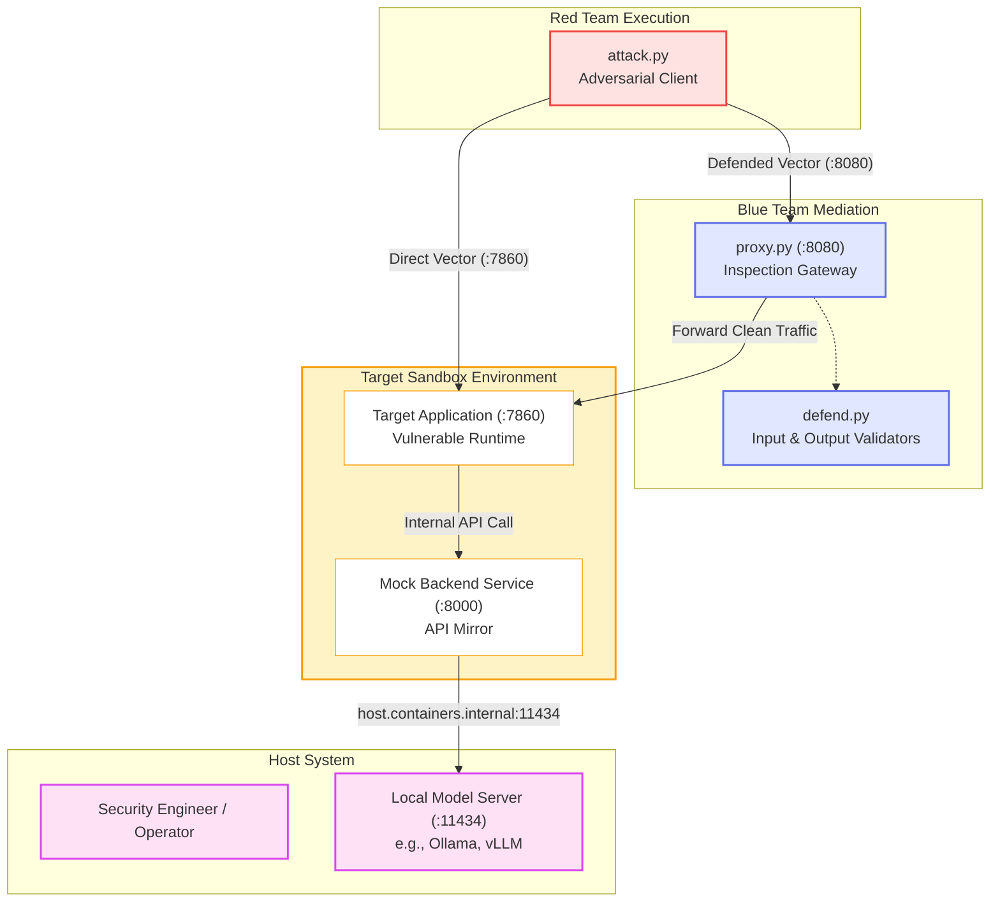

# Gurple Code Labs: Sandboxes, Red Teaming, and Blue Teaming

This directory contains runnable implementations for GenAI security threats documented in Gurple. Each threat lab provides containerized target environments, automated exploitation tools, and defense implementations.

## Tripartite Architecture

Every threat lab is structured into three operational domains:

```text
code/
├── sandbox/<category>/<threat>/     # Containerized vulnerable application and mock services
├── red-team/<category>/<threat>/    # Automated attack scripts and adversarial payloads
└── blue-team/<category>/<threat>/   # Defense validators, mediation proxy, and test suites
```

The sandbox directory (`code/sandbox/`) isolates vulnerable primitives, libraries, and configuration flaws inside containerized target environments. The red-team directory (`code/red-team/`) provides automated clients (`attack.py`) executing payloads declared in TOML configuration files to confirm compromise via HTTP responses or container execution logs. The blue-team directory (`code/blue-team/`) houses reusable validator classes (`defend.py`), inline reverse proxies (`proxy.py`), container log auditors (`detect.py`), and test suites (`test_defense.py`).

## Complete Interaction Architecture

The interaction between an attacker, defensive proxy, sandbox, and local inference engine is illustrated below:



## Network Topology and Port Conventions

Labs use container networking to isolate targets from host infrastructure. Individual threat implementations vary in technology stack, but share common communication patterns across the environment.

Sandbox containers execute within a dedicated bridge network (typically `sec_test_net`) to segregate vulnerable software from local networks. The vulnerable target application exposes an entry point, such as a front-end web UI, REST API, or RPC interface, that Red Team test scripts query directly. Upstream model providers or external tool dependencies are simulated via containerized mock services, removing the need for live third-party accounts or external network egress.

When evaluating defenses, Blue Team reverse proxies sit inline between the client and the sandbox target to inspect incoming payloads and scrub sensitive data from responses. If local models provide inference, containerized services reach host-bound engines through the container runtime's host bridge (`host.containers.internal`).

### Reference Port Allocation Example

Port assignments vary depending on the architecture and dependencies of each vulnerability. Where possible, labs adhere to a consistent convention to avoid port conflicts across sandbox containers, defensive gateways, and host processes. The reference mapping below illustrates this layout for interactive web and API targets, using default ports from common tools such as Gradio (7860) and Ollama (11434):

| Reference Port | Service Role | Component | Description |
| :--- | :--- | :--- | :--- |
| **`7860`** | Target Application Entry Point | Sandbox | Direct attack target (e.g., Gradio UI or API). |
| **`8000`** | Mock Backend API | Sandbox | Upstream mock server (e.g., OpenAI API mirror). |
| **`8080`** | Guardrail Proxy Gateway | Blue Team | Reverse proxy running inline validation filters. |
| **`11434`**| Local Inference Engine | Host | Host-bound LLM server (e.g., Ollama or vLLM). |

## Prerequisites and Tooling

Running the labs requires the following software:

* Astral `uv` for Python packaging and environment management.
* Podman (recommended) or Docker for container isolation.
* Ollama or compatible local inference engines when evaluating attacks against live models.
* GNU Make for task automation.

## Quickstart Guide

All subproject Makefiles support direct execution from the repository root using GNU Make's directory option (`-C`). Replace `<category>/<threat>` with the target lab path, such as `prompt_injection/deserialization`.

### Build the Target Sandbox

Initialize the network and build the target container image:

```bash
make -C code/sandbox/<category>/<threat> build
```

### Run the Red Team Attack

The `all` target runs the complete attack lifecycle by starting the target container, dispatching adversarial payloads, verifying response and log evidence, and stopping the container:

```bash
make -C code/red-team/<category>/<threat> all
```

Individual phases can also be executed against a running target:

```bash
make -C code/red-team/<category>/<threat> setup    # Start sandbox container
make -C code/red-team/<category>/<threat> attack   # Execute automated attack client
make -C code/red-team/<category>/<threat> stop     # Stop sandbox container
```

### Evaluate Blue Team Defenses

Run defense benchmarks and test suites directly on the host without container dependencies:

```bash
make -C code/blue-team/<category>/<threat> all
```

To run individual defense targets:

```bash
make -C code/blue-team/<category>/<threat> defend  # Verify mitigation rates across benchmark payloads
make -C code/blue-team/<category>/<threat> test    # Run parameterized Pytest suite
make -C code/blue-team/<category>/<threat> proxy   # Launch inline reverse proxy gateway
```

### Tear Down the Environment

After completing evaluations, clean up running containers and remove the bridge network:

```bash
make -C code/sandbox/<category>/<threat> down
```
