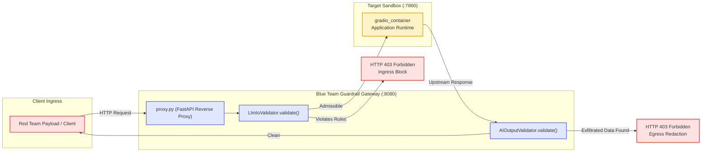

# Blue Team Defense and Mitigation: LangGrinch Deserialization

This directory provides the canonical defense implementation, reverse proxy gateway, and automated test suite for mitigating insecure deserialization attacks (CVE-2025-68664).

## Defense Strategy

Mitigating serialization injection requires defense in depth across input, transport, output, and logging boundaries.

At ingress, `LlmIoValidator` scans incoming payloads with pre-compiled regular expressions targeting serialized object primitives (`"lc": 1`, `"type": "secret"`, and constructor tags) before data reaches application logic. In transit, `proxy.py` operates as an inline reverse proxy on port 8080, evaluating these ingress rules and returning `HTTP 403 Forbidden` on matches while relaying safe traffic to the target application.

At egress, `AIOutputValidator` inspects responses before delivery, scanning for sensitive API keys, cryptographic tokens, or environment variable patterns. Finally, `detect.py` audits container execution traces to identify and alert on historical exploit attempts recorded in runtime logs.

## Defense Pipeline Architecture

The mediation flow enforces security checks at both ingress and egress points:

## Component Architecture

The defense implementation consists of four modules. Core validation logic resides in `defend.py`, which implements `LlmIoValidator` and `AIOutputValidator` alongside a benchmark CLI verifying detection performance against adversarial and benign prompts. Network mediation is handled by `proxy.py`, an ASGI reverse proxy on port 8080 that filters incoming traffic before forwarding clean requests to the target container. Audit capabilities are provided by `detect.py`, which scans `podman logs gradio_container` for exfiltrated secrets and security alerts. Finally, `test_defense.py` supplies automated Pytest coverage across boundary conditions and edge cases.

## Execution Guide

Common operational workflows are defined in the `Makefile`:

| Target | Description |
| :--- | :--- |
| `make defend` | Runs standalone defense benchmark verifying 100% block rate. |
| `make test` | Executes parameterized test suite via Pytest. |
| `make proxy` | Starts the inline reverse proxy gateway on port `8080`. |
| `make detect` | Audits container execution logs for attack artifacts. |
| `make format` | Formats and lints code using Ruff. |

## Signature and Heuristic Specifications

The `LlmIoValidator` inspects incoming JSON payloads against pre-compiled signature patterns:

| Target Token / Pattern | Target Primitive | Mitigation Mechanism |
| :--- | :--- | :--- |
| `"lc"\s*:\s*1` | Serialized Object | Flags root markers for LangChain serialization schemas. |
| `"type"\s*:\s*"secret"` | SecretStr Reference | Blocks dynamic environment variable and secret resolution. |
| `"type"\s*:\s*"constructor"` | Constructor Tag | Prevents arbitrary class instantiation attempts. |
| `"type"\s*:\s*"exec"` | Dynamic Code Block | Blocks execution primitives embedded in serialized JSON. |
| `__init__`, `langchain`, `Bedrock`, `"endpoint_url"` | Bedrock Injections | Intercepts parameter injection overrides targeting AWS Bedrock. |
