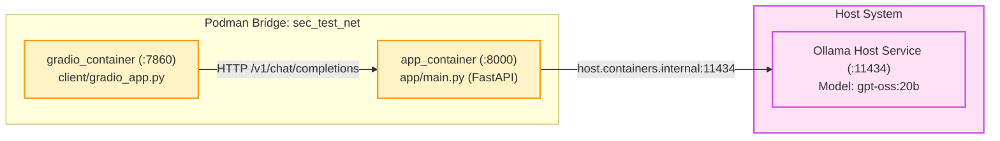

# Vulnerable Sandbox: LangGrinch Deserialization (LangChain <= 1.2.4)

> [!WARNING]
> This container environment contains intentional security vulnerabilities for educational and research purposes. Do not expose this service on untrusted networks or production environments.

## Vulnerability Overview and References

| Parameter | Specification |
| :--- | :--- |
| **Vulnerability Identifier** | CVE-2025-68664 / LangGrinch |
| **Affected Library** | `langchain-core==1.2.4`, `langchain==1.2.0` |
| **Vulnerable Function** | `langchain_core.load.loads(..., secrets_from_env=True)` |
| **Flaw Mechanism** | Arbitrary object and environment variable resolution via serialized `SecretStr` entries |
| **Source Pointer** | [`client/gradio_app.py`](client/gradio_app.py) |

When untrusted input containing LangChain serialized objects (`"lc": 1`) is parsed with `secrets_from_env=True`, the deserializer resolves arbitrary environment variables (such as `FLAG`).

## Architecture Topology

The sandbox environment isolates the vulnerable application and mock service on the `sec_test_net` bridge:



## Prerequisites and Setup

Ensure that `uv` and Podman (or Docker) are installed:

```bash
# Pull model and start Ollama service on host
ollama pull gpt-oss:20b
ollama serve
```

## Available Commands

The sandbox lifecycle is managed through Make:

| Target | Description |
| :--- | :--- |
| `make build` | Creates bridge network `sec_test_net` and builds image `sandbox_langgrinch`. |
| `make up` | Starts mock backend `app_container` on port `8000`. |
| `make run-gradio-headless` | Launches vulnerable Gradio interface `gradio_container` on port `7860`. |
| `make stop-gradio` | Stops and cleans up `gradio_container`. |
| `make down` | Stops backend and tears down network `sec_test_net`. |
| `make format` | Formats and lints code using Ruff. |
| `make clean` | Removes containers and local image. |

## Docker Command Reference

If running Docker instead of Podman, use the equivalent commands:

```bash
# Create bridge network
docker network create sec_test_net

# Build image
docker build -f Containerfile -t sandbox_langgrinch .

# Launch backend
docker run -d --rm --name app_container --network sec_test_net -p 8000:8000 sandbox_langgrinch

# Launch Gradio client
docker run -d --rm --name gradio_container --network sec_test_net -p 7860:7860 \
  -e BACKEND_URL="http://app_container:8000/v1" \
  -e FLAG="C0ngr4ts_y0u_f0und_m3" \
  sandbox_langgrinch uv run python client/gradio_app.py

# Teardown
docker stop gradio_container app_container
docker network rm sec_test_net
```
