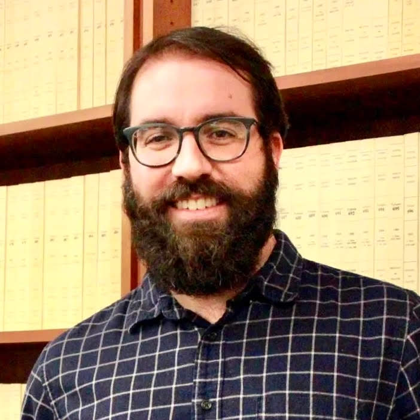

  <h1 style="color:var(--aurora); font-size: 3em; font-weight: bold;">About the Author</h1>

## **Felipe Campos Penha**

Hi! My name is Felipe. I hold a Physics Doctorate Degree from the State University of Campinas (UNICAMP) and I have 8+ years of industry experience in the AI Engineering and Data Science area, amounting to 12+ years of hands-on data-related work.

I am an active contributor and a Code Work Stream Leader for the [OWASP GenAI Security Project](https://genai.owasp.org/) – [Red Teaming Initiative](https://genai.owasp.org/initiatives/#ai-redteaming).

Experienced speaker, both online and offline, having accumulated 45,000+ views on YouTube and Twitch and presented to 3,000 people in the same online workshop session.

I am open to invitations to speak at tech talks, conferences, and meetups.

 

## **Cybersecurity Publications**

* [OWASP GenAI Data Security Risks & Mitigations 2026](https://genai.owasp.org/resource/owasp-genai-data-security-risks-mitigations-2026/)

* [OWASP Vendor Evaluation Criteria for AI Red Teaming Providers & Tooling v1.0](https://genai.owasp.org/resource/owasp-vendor-evaluation-criteria-for-ai-red-teaming-providers-tooling-v1-0/)

## **Cybersecurity Open Source Code**

* [OWASP GenAI-Security-Project/GenAI-Red-Team-Lab](https://github.com/GenAI-Security-Project/GenAI-Red-Team-Lab)

## **Other Pages**

* [DataScienceBits YouTube Channel](https://www.youtube.com/c/DataScienceBits)
* [GitHub Profile](https://github.com/felipepenha)

## **Suggestions for the Book**

Feel free to open new entries at the [GitHub Issues Page](https://github.com/felipepenha/gurple/issues).

## **Contact**

* [felipe.penha@owasp.org](mailto:felipe.penha@owasp.org)
* [LinkedIn](https://linkedin.com/in/fcpenha)