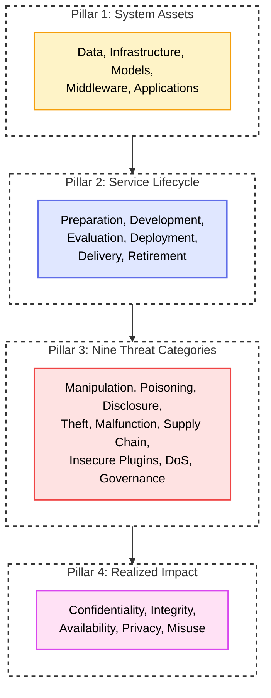

# **CSA LLM **Threats** Taxonomy**

This section details the **Large Language Model (LLM) **Threats** Taxonomy** published by the Cloud Security Alliance ([CSA LLM **Threats** Taxonomy](https://cloudsecurityalliance.org/artifacts/csa-large-language-model-llm-**Threats**-taxonomy)). [@CSA:LLM:Taxonomy:2024:PDF]

 

---
# **Summary**

The Cloud Security Alliance (CSA) AI Controls Framework Working Group published the Large Language Model **Threats** Taxonomy in June 2024 under the CSA AI Safety Initiative. The framework establishes a unified conceptual architecture and standardized terminology to evaluate risk scenarios across enterprise generative AI deployments. 

Prior security models approached ML risks through isolated lenses: Data Scientists tracked adversarial noise in computer vision, Infrastructure Engineers monitored virtual machines, and Frontend Engineers audited User Interfaces. The CSA taxonomy harmonizes these disparate disciplines into an integrated architectural framework. It adapts the system lifecycle principles of ISO/IEC 5338 [@ISO:IEC:5338:2023] and incorporates adversarial terminology from NIST AI 100-2 [@NIST:AI:100-2e2023].

```mermaid
flowchart TD
    subgraph dashed_box_assets ["Pillar 1: System Assets"]
        Assets["Data, Infrastructure, Models,<br />Middleware, Applications"]
    end
    subgraph dashed_box_lifecycle ["Pillar 2: Service Lifecycle"]
        Lifecycle["Preparation, Development,<br />Evaluation, Deployment,<br />Delivery, Retirement"]
    end
    subgraph dashed_box_**Threats** ["Pillar 3: Nine Threat Categories"]
        **Threats**["Manipulation, Poisoning, Disclosure,<br />Theft, Malfunction, Supply Chain,<br />Insecure Plugins, DoS, Governance"]
    end
    subgraph dashed_box_impact ["Pillar 4: Realized Impact"]
        Impact["Confidentiality, Integrity,<br />Availability, Privacy, Misuse"]
    end

    dashed_box_assets --> dashed_box_lifecycle
    dashed_box_lifecycle --> dashed_box_**Threats**
    dashed_box_**Threats** --> dashed_box_impact

    classDef red fill:#fee2e2,stroke:#ef4444,stroke-width:2px,color:#000;
    classDef yellow fill:#fef3c7,stroke:#f59e0b,stroke-width:2px,color:#000;
    classDef blue fill:#e0e7ff,stroke:#5f6de9,stroke-width:2px,color:#000;
    classDef purple fill:#ffe1f5,stroke:#d946ef,stroke-width:2px,color:#000;

    class Assets yellow;
    class Lifecycle blue;
    class **Threats** red;
    class Impact purple;

    style dashed_box_assets stroke-dasharray: 5 5, fill:none,stroke:#333,stroke-width:2px;

    style dashed_box_lifecycle stroke-dasharray: 5 5, fill:none,stroke:#333,stroke-width:2px;

    style dashed_box_**Threats** stroke-dasharray: 5 5, fill:none,stroke:#333,stroke-width:2px;

    style dashed_box_impact stroke-dasharray: 5 5, fill:none,stroke:#333,stroke-width:2px;
```

  <em>Figure 1: The four architectural pillars of the CSA LLM **Threats** Taxonomy.</em>

## **Categorical Foundations: Weaknesses, Vulnerabilities, and Threats**

A central contribution of the CSA taxonomy is its formal separation of **Weaknesses**, **Vulnerabilities**, and **Threats**, resolving pervasive terminological confusion across the AI industry.

**Weaknesses** represent intrinsic design attributes, inductive biases, and statistical limitations inherent to probabilistic neural models. Examples include the inability to separate instructional prompts from untrusted data in natural language contexts, tendency toward hallucination when sampling outside training distributions, and susceptibility to floating-point rounding variations. **Weaknesses** are mathematical properties of the architecture rather than bugs.

**Vulnerabilities** denote actionable control deficiencies and exploitable states in software runtimes, deployment pipelines, configuration baselines, or access models. These flaws allow an adversary to trigger an underlying weakness. Examples include exposing unauthenticated tool invocation endpoints, failing to sanitize RAG database entries, using unencrypted prompt caches, or granting unconstrained network egress to an inference container.

**Threats** represent active adversary tactics or adverse operational events that exploit **Weaknesses** or **Vulnerabilities** to achieve malicious goals. **Threats** encompass deliberate campaigns such as automated jailbreak fuzzing, indirect prompt injection delivered via untrusted web documents, training set poisoning, model parameter extraction, etc.

## **The Four Pillars of the Taxonomy**

The CSA taxonomy structures the security landscape around four interconnected pillars: System Assets, Service Lifecycle, Impact Categories, and Threat Categories.

### **Pillar 1: System Assets**

The framework classifies enterprise LLM systems into five distinct asset clusters, establishing clear ownership boundaries across engineering teams:

1. **Data Assets**: The core knowledge inputs, parameters, and telemetry powering the system. This cluster includes pre-training text corpora, supervised fine-tuning records, external RAG (RAG) knowledge stores, metadata data cards recording provenance and consent, active user session histories, prompt inputs, generated output tokens, internal weight matrices, training hyperparameters, and operational audit logs.
2. **LLM-Ops Environment**: The underlying physical and cloud infrastructure supporting system execution. This tier comprises distributed training clusters, inference endpoints, application hosting runtimes, multi-cloud interconnects, identity and access management (IAM) perimeters, network ingress controllers, and long-term cloud object stores housing model weights.
3. **Model**: Beyond stored model weights (covered in **Data Assets** above), the CSA defines the model through its architectural structure, its specialization level (base foundational versus fine-tuned models), its distribution mode (model file versus API access), and its model card [@HuggingFace:ModelCards:WEB], which records training lineage, ownership, and testing baselines.
4. **Orchestrated Services**: Middleware components that intermediate between foundation models, auxiliary microservices, and external systems. Assets include response caching layers, specialized LLM security gateways, automated deployment pipelines, continuous monitoring services, runtime optimization engines (such as quantization and weight pruning routines), security plugins, and general agent execution loops handling planning and tool dispatch.
5. **AI Applications**: Downstream, user-facing software products delivering generative and agentic capabilities to humans or automated workflows.

### **Pillar 2: The Six-Stage Service Lifecycle**

Drawing upon ISO/IEC 5338, the taxonomy decomposes an LLM service into six sequential phases. Each stage introduces specific security requirements and defensive obligations:

1. **Preparation**: Engineering teams source training datasets, establish ethical and legal collection criteria, and execute data curation. Curation includes deduplication, filtering, anonymization, and labeling. Teams provision hardware resources (GPUs and TPUs), configure storage with verifiable chain-of-custody tracking, and assemble multidisciplinary teams spanning ML engineers, software developers, domain specialists, and privacy officers.
2. **Development**: The functional model is constructed from prepared data and computational infrastructure. Activities encompass architecture selection (transformer layer depth, attention mechanisms), hyperparameter tuning, framework selection (PyTorch, TensorFlow, Ray), iterative gradient training, and tokenization. Key considerations include training transparency, explainability, computational resource efficiency, and strict artifact version control to ensure complete build reproducibility.
3. **Evaluation and Validation**: Prior to operational release, the model undergoes exhaustive testing. Teams compute quantitative metrics (perplexity, task accuracy, BLEU scores) and gather qualitative human judgments of fluency and relevance. This stage mandates bias and fairness audits, real-world generalization testing, human-in-the-loop review, and adversarial Red Teaming to discover jailbreaks and boundary failures. Re-evaluation routines monitor for data drift (shifting real-world input distributions) and model drift (declining task prediction quality) after deployment, establishing empirical triggers for model retraining.
4. **Deployment**: Validated models are integrated into production environments. Workflows leverage containerization, auto-scaling architectures, and Infrastructure as Code (IaC) to guarantee repeatable deployments. Engineers harden the AI supply chain across external agent protocols and third-party plugins, implementing runtime guardrails such as input classifiers, prompt injection defenses, output sanitizers, and PII filters.
5. **Delivery**: This operational phase encompasses steady-state maintenance, real-time logging, telemetry ingestion, performance monitoring, security incident response, and structured feedback collection. Maintenance schedules govern defect remediation, library patching, base model version tracking, and planned downtime communications. Continuous improvement cycles use feedback loops to refine hyperparameters and test newer candidate architectures.
6. **Service Retirement**: When a model becomes obsolete, redundant, or legally untenable, it undergoes formal decommissioning. Teams archive model weights, software configurations, and audit records in compliance with enterprise retention schedules. Personal and sensitive data is purged across training and session stores to satisfy data governance mandates such as GDPR and CCPA. Finally, organizations perform cryptographically secure disposal of model artifacts and physical media sanitization (shredding or degaussing) to eliminate residual recovery risks.

### **Pillar 3: Impact Categories and the Extended CIA Triad**

The taxonomy anchors consequence evaluation in the classic Confidentiality, Integrity, and Availability triad, while incorporating modern extensions from NIST AI 100-2:

* **Loss of Confidentiality**: Unauthorized exposure of intellectual property, model weights, training corpora, proprietary system instructions, or sensitive user session data through extraction attacks, inversion techniques, or unauthenticated log storage.
* **Loss of Integrity**: Intentional or accidental corruption of training weights, fine-tuning data, retrieval context, or generated model outputs. Compromised integrity results in biased predictions, misleading information, or attacker-controlled responses that undermine system trust.
* **Loss of Availability**: Interruption of inference endpoints, exhaustion of API rate limits, computational memory starvation, or infrastructure failure preventing legitimate access to the generative service.
* **Loss of Privacy**: Unauthorized extraction of personal identity attributes or inferential profiling derived from training memorization or session histories.
* **Abuse/Misuse**: Weaponization of model capabilities for automated cyberattacks, social engineering, disinformation campaigns, or unauthorized autonomous actions.

### **Pillar 4: The Nine Threat Categories**

The taxonomy groups adversarial attack surfaces and operational hazards into nine discrete threat categories:

1. **Model Manipulation**: Evasion techniques, direct prompt injections, and indirect prompt injections embedded in external content that manipulate model reasoning, override safety filters, or coerce the system into generating illicit outputs.
2. **Data Poisoning**: Injection of malicious, falsified, or biased samples into pre-training corpora, fine-tuning datasets, or retrieval databases. Poisoning implants persistent backdoors or skews classification boundaries, degrading model trustworthiness.
3. **Sensitive Data Disclosure**: Unauthorized exposure of proprietary corporate documents, personal data, or secret credentials processed by the service. Disclosure occurs via model memorization extraction, unintended caching, or insecure output generation.
4. **Model Theft**: Unauthorized extraction, distillation, parameter estimation, or reverse engineering of proprietary models. Competitors or threat actors replicate intellectual property without incurring the underlying capital training expenditure.
5. **Model Failure and Malfunctioning**: Unplanned operational degradation resulting from software defects, unhandled runtime exceptions, hardware memory faults, hallucinated outputs, or undetected concept drift.
6. **Insecure Supply Chain**: **Vulnerabilities** introduced through third-party foundation models, untrusted pre-trained checkpoints, compromised software dependencies (such as malicious PyPI or npm packages), or hardware components.
7. **Insecure Applications and Plugins**: Flaws within tool interfaces, client software wrappers, or third-party extensions. **Vulnerabilities** permit unauthorized privilege escalation, insecure output handling, or downstream command injection in connected host environments.
8. **Denial of Service (DoS)**: High-volume request flooding, complex recursive queries, or computational sponge attacks designed to consume disproportionate memory and compute resources, rendering the service unavailable.
9. **Loss of Governance and Compliance**: Inability to demonstrate regulatory adherence, maintain traceable audit records, satisfy compliance mandates (such as the EU AI Act), or enforce internal safety policies, resulting in severe financial and legal liabilities.

## **Taxonomy Synthesis Table**

The matrix below maps the nine threat categories against their targeted assets, susceptible lifecycle stages, primary impact dimensions, and primary defensive controls.

| Threat Category | Targeted Assets | Susceptible Lifecycle Stages | Impact Dimensions | Primary Defensive Controls |
| :--- | :--- | :--- | :--- | :--- |
| **Model Manipulation** | Model Artifacts, AI Applications, Session Data | Evaluation, Deployment, Delivery | Loss of Integrity, Abuse/Misuse | Dual-LLM validation, prompt sandboxing, input token sanitization |
| **Data Poisoning** | Data Assets, Model Weights, Hyperparameters | Preparation, Development, Evaluation | Loss of Integrity, Abuse/Misuse | Cryptographic data hashing, source vetting, anomaly detection in corpora |
| **Sensitive Data Disclosure** | Data Assets, Model Outputs, Log Data | Deployment, Delivery, Retirement | Loss of Confidentiality, Loss of Privacy | Differential privacy, PII tokenization, context sanitization |
| **Model Theft** | Model Weights, Hyperparameters, Model Cards | Deployment, Delivery, Retirement | Loss of Confidentiality, Intellectual Property Theft | API rate limiting, perturbation defense, output watermarking |
| **Model Failure/Malfunctioning** | Model Artifacts, Orchestrated Services | Development, Evaluation, Delivery | Loss of Availability, Loss of Integrity | Human-in-the-loop review, automated drift detection, guardrail fallback |
| **Insecure Supply Chain** | Model Weights, Software Libraries, Infrastructure | Preparation, Development, Deployment | Loss of Integrity, Loss of Confidentiality | Software Bill of Materials (SBOM), cryptographic signature verification |
| **Insecure Apps/Plugins** | Orchestrated Services, AI Applications, APIs | Deployment, Delivery | Loss of Integrity, Loss of Confidentiality | Strict parameter schemas, least privilege execution, output validation |
| **Denial of Service** | LLM-Ops Infrastructure, Orchestrated Services | Deployment, Delivery | Loss of Availability, Financial Exhaustion | Context length caps, compute quotas, inference request throttling |
| **Loss of Governance** | Data Cards, Model Cards, Application Cards | Preparation, Delivery, Retirement | Regulatory Liability, Reputational Damage | Model lineage registers, automated audit logging, compliance verification |

 

---
## **Role in Purple Teaming**

Purple teams use the CSA LLM **Threats** Taxonomy to replace fragmented, ad-hoc prompt testing with structured, lifecycle-aware validation exercises. Instead of treating LLMs as standalone black boxes at the application layer, collaborative operators assess risk across all four taxonomy pillars.

During exercise scoping, the Red Team references the nine threat categories to develop comprehensive adversary emulation plans. Operators simulate real-world attack chains: crafting indirect prompt injections embedded in retrieval stores (Threat 1), submitting high-dimensional extraction queries to evaluate model distillation risks (Threat 4), and testing whether manipulated plugin parameters achieve unauthorized command execution (Threat 7). 

In response, the Blue Team uses the asset classification and lifecycle breakdown to position layered defensive controls. Defensive engineers place security gateways ahead of inference endpoints to detect anomalous token distributions, deploy strict schema validation on tool integration boundaries, and establish continuous monitoring for model drift. 

By conducting joint validation across preparation, development, deployment, and live delivery phases, Purple teams uncover structural gaps that traditional web application assessments overlook.

 

---
# Mapping to SCF C|P-RMM

In SCF C|P-RMM, a **Vulnerability** is directly associated to **Control Deficiencies** (an absent, failing, or misconfigured security control). This definition is broad enough such that it must encompass both CSA's **Weaknesses** (intrinsic statistical and architectural constraints of neural networks) and CSA's **Vulnerabilities** (implementation states or configuration errors that can be exploited).

To put it another way, certain model hardening techniques (such as input sanitization, adversarial training, or model constitutions) can be seen as the implementation of security controls of the LLM, and hence an absence or failure of those techniques (which translates to a CSA **Weakness**) can be considered a SCF C|P-RMM **Vulnerability**.

 

---
# **Critique**

The CSA LLM **Threats** Taxonomy provides an essential, holistic foundation for securing generative ML systems. Its primary strength lies in its comprehensive lifecycle scope. By grounding security in ISO/IEC 5338 processes from initial preparation through service retirement, the taxonomy prevents organizations from focusing solely on runtime inference while ignoring upstream data poisoning and downstream decommissioning liabilities. Furthermore, its formal distinction between mathematical **Weaknesses**, software **Vulnerabilities**, and operational **Threats** brings much-needed precision to risk discussions.

The framework's primary architecture centers around single-model request-response pipelines and conversational applications. While it acknowledges general agents under Orchestrated Services, it lacks detailed threat modeling for autonomous multi-agent environments. Emergent risks such as inter-agent protocol exploitation, automated delegation chains, and decentralized agent marketplaces require specialized companion frameworks such as [CSA MAESTRO](./csa_maestro.md) to achieve complete architectural coverage.
