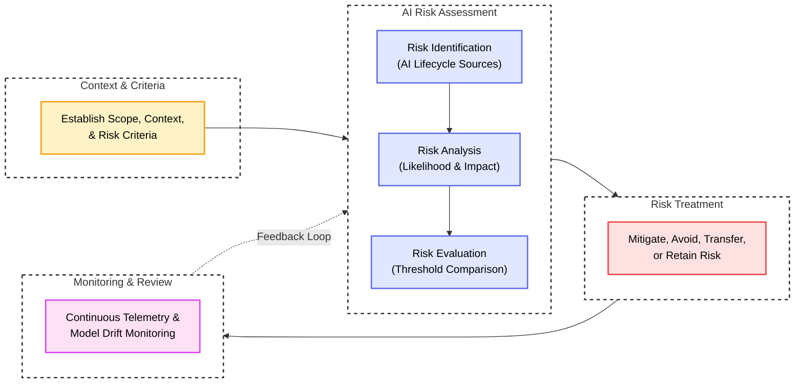

# **ISO/IEC 23894:2023**

This section details **ISO/IEC 23894:2023** (*Information technology &mdash; Artificial intelligence &mdash; Guidance on risk management*), published jointly by the International Organization for Standardization and the International Electrotechnical Commission ([ISO/IEC 23894:2023](https://www.iso.org/standard/77304.html)). [@ISO:IEC:23894:2023; @ANSI:ISO:23894:2023:WEB]

This framework is documented within Gurple solely for institutional and architectural completeness. Because the official standard is restricted behind a commercial paywall and requires purchase, it is excluded from granular threat mappings across the threats catalog.

 

---
# **Summary**

Published in February 2023 by ISO/IEC JTC 1/SC 42 (the joint technical committee responsible for artificial intelligence), ISO/IEC 23894:2023 establishes comprehensive international guidelines for managing risk across organizations developing, providing, or integrating artificial intelligence systems.

Unlike traditional software risk management guidelines, ISO/IEC 23894 specifically addresses the unique failure modes of machine learning, including non-deterministic outputs, opaque internal representations, algorithmic bias, and continuous concept drift. It is explicitly designed as a guidance document rather than a certifiable audit specification. Organizations frequently leverage ISO/IEC 23894 to design the risk assessment workflows required to achieve certification under **ISO/IEC 42001:2023** (Artificial Intelligence Management System) or demonstrate alignment with regulatory frameworks like the European Union AI Act.

  <em>Figure 1: The AI risk management process workflow adapted from ISO 31000 in ISO/IEC 23894:2023.</em>

## **Harmonization with the ISO 31000 Risk Architecture**

Rather than creating an isolated methodology, ISO/IEC 23894 directly integrates with **ISO 31000:2018** (the foundational international standard for enterprise risk management). It mirrors the clause structure of ISO 31000, customizing each core component for artificial intelligence:

1. **Principles**: Risk management must create and protect value, integrate into all organizational activities, account for human and cultural factors, remain customized to the operational environment, and facilitate continual improvement despite probabilistic AI behaviors.
2. **Framework**: Organizations must embed AI risk oversight into leadership structures, assign clear accountability for model stewardship, allocate sufficient compute resources for verification, and continually adapt risk governance as models evolve.
3. **Process**: The structured lifecycle for assessing and treating AI risks, comprising scope definition, risk assessment (identification, analysis, evaluation), risk treatment, continuous communication, and ongoing monitoring.

## **Artificial Intelligence Risk Dimensions**

ISO/IEC 23894 outlines the technical properties of AI systems that challenge conventional cybersecurity and risk evaluation models:

* **Opacity and Complex Interpretability**: Deep neural representations obscure the causal connections between input parameters and resulting outputs. This opacity impairs root-cause analysis when the model generates anomalous or hazardous predictions.
* **Probabilistic and Non-Deterministic Behavior**: Unlike conventional deterministic code where static inputs yield invariant outputs, generative models exhibit stochastic variability. Identical prompts can yield divergent reasoning paths across successive inference runs.
* **Data Dependency and Vulnerability to Drift**: Model effectiveness relies on the distribution, quality, and provenance of training and inference data. Changes in user behavior, macroeconomic factors, or operational environments introduce data drift and model drift, degrading predictive accuracy without raising software exceptions.
* **Bias and Societal Disparities**: Unrepresentative, historical, or systematically skewed training corpora propagate into model inferences, generating discriminatory or legally actionable outcomes across demographic groups.
* **Autonomous Agency and Delegated Authority**: Automated agent loops executing external tool invocations introduce execution risks where flawed reasoning directly alters production databases, executes code, or moves funds without intermediate human authorization.

## **Lifecycle Integration Across AI Systems**

Aligned with ISO/IEC 22989 and ISO/IEC 5338, ISO/IEC 23894 embeds risk management activities across the entire system lifecycle:

* **Inception and Feasibility**: Defining system objectives, assessing ethical viability, evaluating regulatory constraints, and determining whether machine learning is suitable for the target problem.
* **Data Collection and Engineering**: Sourcing, filtering, labeling, and verifying training corpora while identifying potential poisoning, privacy exposure, or sampling bias.
* **Model Training and Refinement**: Selecting neural architectures, tuning hyperparameters, running gradient optimization, tracking loss metrics, and securing model weights against theft or tampering.
* **Verification and Validation**: Executing empirical testing against safety benchmarks, conducting red teaming exercises, evaluating robustness against adversarial perturbations, and verifying fairness metrics.
* **Deployment and Operational Monitoring**: Implementing runtime guardrails, sanitizing input prompts, monitoring output safety, tracking telemetry for latency and accuracy degradation, and detecting concept drift.
* **Decommissioning and Disposal**: Securely archiving model artifacts, executing cryptographic data sanitization, and purging sensitive training records to satisfy data protection regulations.

## **Risk Management Clauses and AI Adaptations**

The table below outlines how ISO/IEC 23894 customizes the standard ISO 31000 risk management process clauses for artificial intelligence environments.

| ISO 31000 Clause | AI-Specific Risk Guidance in ISO/IEC 23894 | Operational Engineering Objective |
| :--- | :--- | :--- |
| **Scope, Context, & Criteria** | Establish boundaries around model autonomy, intended use cases, data sensitivity, and applicable legal frameworks (e.g., EU AI Act risk tiers). | Define acceptable operational risk thresholds and determine model governance boundaries. |
| **Risk Identification** | Identify AI-specific hazards across data sourcing, model architecture, runtime dependencies, and downstream integration touchpoints. | Uncover prompt injection surfaces, data poisoning vectors, hallucination liabilities, and supply chain dependencies. |
| **Risk Analysis** | Analyze the mathematical likelihood and potential business impact of non-deterministic model failures, adversarial exploits, and performance drift. | Quantify the blast radius of autonomous agent tool misuse, data leakage, and discriminatory outputs. |
| **Risk Evaluation** | Compare analyzed risk levels against organizational risk appetite criteria to prioritize engineering mitigations. | Determine whether model performance and safety profiles permit production release. |
| **Risk Treatment** | Select and implement technical safeguards, including input sanitizers, dual-model verification, human-in-the-loop gates, and fallback mechanisms. | Deploy defensive controls to bring residual risk within established enterprise thresholds. |
| **Monitoring & Review** | Continuously track inference telemetry, input token distributions, accuracy metrics, and emergent adversarial techniques. | Detect data drift, model degradation, and novel prompt injection vectors during live production. |

 

---
## **Role in Purple Teaming**

Purple teams use the risk assessment and monitoring clauses of ISO/IEC 23894 to ground offensive exercises in formal enterprise risk criteria. Rather than conducting unfocused penetration tests, collaborative operators align their activities with the standard's structured workflow:

During the risk identification and analysis phases, the Red Team acts as the adversary emulation arm, stress-testing whether identified failure modes can be exploited in practice. Operators execute targeted prompt injections, attempt model weight extraction, and test whether poisoned training samples survive curation filters. This testing replaces speculative likelihood estimates with empirical evidence of system exploitability.

During the risk treatment and monitoring phases, the Blue Team designs and deploys mitigating controls based on Red Team findings. Defensive engineers configure specialized security gateways, implement parameter validation on agent tools, and deploy real-time drift detection heuristics. The Purple Team then retests these mitigations to measure residual risk reduction, documenting verified control effectiveness in formal audit registers.

 

---
# Mapping to SCF C|P-RMM

Reconciling **ISO/IEC 23894:2023** with the **[SCF C|P-RMM](../threat_vulnerability_risk/scf_cp_rmm.md)** framework translates high-level risk guidance into standardized tripartite components:

$$\text{Risk} = \text{Threat} \times \text{Vulnerability} \times \text{Impact}$$

### **1. Adversary Actions and Environmental Triggers as Threats**

Under SCF C|P-RMM, a Threat is an external entity, action, or environmental trigger capable of causing harm. ISO/IEC 23894 categorizes both intentional adversary actions and operational environmental hazards as sources of risk:

* External adversaries executing prompt injection or model evasion attacks against inference interfaces.
* Threat actors injecting malicious data points into third-party pre-training corpora or public fine-tuning datasets.
* Competitors querying inference endpoints to reverse-engineer model weights via distillation.
* Environmental distribution shifts in real-world data triggering unanticipated model drift.

### **2. AI Implementation Gaps as Control Deficiencies**

In SCF C|P-RMM, a Vulnerability is strictly defined as a *Control Deficiency* (an absent, failing, or misconfigured security control). ISO/IEC 23894 identifies core operational deficiencies that permit threats to succeed:

* **Absence of Ingress Sanitization**: Lack of input validation, token filtering, or prompt sandboxing ahead of inference runtimes.
* **Deficient Data Provenance Controls**: Failure to verify dataset integrity, track data lineage, or maintain cryptographic checksums on training assets.
* **Unconstrained Tool Authority**: Granting broad execution permissions to autonomous agents without schema validation or approval checkpoints.
* **Missing Telemetry and Drift Detection**: Failure to continuously monitor prediction distributions and loss metrics during production operations.

### **3. Enterprise Consequences as Realized Risk**

In SCF C|P-RMM, Risk is the measurable operational, financial, or reputational damage realized when a threat successfully exploits a control deficiency:

* **Decisional Compromise**: Corrupted business decisions, medical misdiagnoses, or faulty automated operations resulting from hallucinated or manipulated model inferences.
* **Regulatory Penalties**: Severe fines and operational bans imposed under risk-based compliance regimes like the EU AI Act for unmitigated high-risk systems.
* **Intellectual Property Exfiltration**: Loss of proprietary model parameters or confidential training information.
* **Systemic Discrimination**: Legal liability and brand damage arising from uncorrected demographic bias in model predictions.

 

---
# **Critique**

ISO/IEC 23894:2023 provides an authoritative, globally recognized framework that bridges general enterprise risk management with the specialized complexities of artificial intelligence. By directly adapting the established ISO 31000 architecture, it allows organizations to incorporate AI systems into existing corporate governance and risk committees without inventing incompatible terminology. Furthermore, its comprehensive lifecycle perspective ensures that teams address risks during data collection and model design rather than treating security purely as an operational runtime problem.

However, organizations evaluating the framework encounter significant practical limitations:

First, ISO/IEC 23894 provides broad, high-level guidance rather than prescriptive technical specifications. It defines *what* processes an organization should establish, but offers minimal actionable guidance on *how* software engineers should configure token filters, evaluate attention weights, or build container sandboxes. Engineering teams must invest heavy internal effort translating the standard's conceptual clauses into functional defenses.

Second, the standard is locked behind a commercial paywall and requires individual purchase from national standardization bodies. Unlike open-source frameworks published by NIST, MITRE, OWASP, and the Secure Controls Framework, ISO/IEC 23894 cannot be freely inspected, distributed, or integrated into automated compliance tooling. This commercial inaccessibility restricts broader community peer review, prevents academic collaboration, and creates unnecessary friction for smaller security teams and open-source projects. For this reason, Gurple documents the framework for structural completeness while omitting it from granular threat mapping tables.

Finally, having been drafted primarily during the emergence of predictive machine learning, the standard reflects a classical statistical view of AI systems. It lacks detailed treatment of modern generative foundation models, complex agentic tool-use loops, dynamic multi-agent delegation frameworks, and natural language injection vectors, requiring supplementation with specialized modern frameworks like [CSA MAESTRO](./csa_maestro.md) and [OWASP Top 10 for Agentic](./owasp_top_10_agentic.md).
