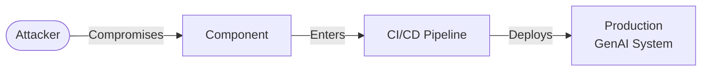
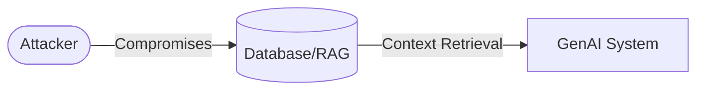

<div style="text-align: center; color:var(--aurora)">

<p style="font-size: 8em; margin-top: 0px; margin-bottom: 0px; font-weight: bold;">
2
</p>
<h1 style="color:var(--aurora); font-size: 3em; font-weight: bold;">
Attack Entry Points
</h1>

</div>

Production GenAI systems are complex applications with a broad Attack Surface that extends well beyond the GenAI models. Attackers can exploit numerous entry points to introduce malicious inputs, manipulate context, or compromise infrastructure.

<br />

------------------------------------------------------------------------

# **The Front Door** 🚪 <br /> **— Network & Application Interfaces**

These are the primary interaction points where the system accepts multimodal input for inference.

<br />

-   **Application Programming Interface (API) Endpoints**

    Attackers may input data via the application’s API endpoints, directly accessing the model or orchestration layer.

    **Examples of structured data:** structured data (JSON, XML, etc), inputs to forms (name, address, etc), feedback (thumbs up, thumbs down, etc).

    **Examples of unstructured data:** prompts, documents (PDF, Doc, etc), free text, images, videos, audio, code (SQL, Python, etc).

    ``` mermaid
    graph LR
        Attacker([Attacker]) -->|Malicious Payload| API[API Endpoint]
        API -->|Payload| Model[GenAI System]
    ```

<br />

-   **User Interface (UI)**

    Attackers may input either structured or unstructured data via the UI, which is then processed by the GenAI system.

    Examples for UI input data would be exactly the same as for API Endpoints, since UI interactions are ultimately translated into API calls.

    ``` mermaid
    graph LR
        Attacker([Attacker]) -->|Input| UI[User Interface]
        UI -->|API Call| API[API Endpoint]
        API -->|Payload| Model[GenAI System]
    ```

<br />

-   **Sensors**

    Attackers may present malicious signals to physical sensors (cameras, microphones, motion sensors, etc), which are then processed by the GenAI system.

    **Examples of malicious signals:** noise (adversarial examples), signals going beyond the sensor’s range, evading identification, inducing misclassification.

    ``` mermaid
    graph LR
        Attacker([Attacker]) -->|Adversarial Signal| Sensor[Sensor]
        Sensor -->|Digital Signal| Model[GenAI System]
    ```

<br />

-   **Observability Integration Interfaces**

    Attackers may target the observability integration protocols to blind defenders or exfiltrate sensitive model inputs/outputs.

    **Examples of integration protocols:** OpenTelemetry (OTel), HTTPS logging streams.

    ``` mermaid
    graph LR
        Attacker([Attacker]) -.->|Exploits/Blinds| OTel[Observability System]
        System[GenAI System] -->|Logs/Traces| OTel
        OTel -->|Feeds| Dash[Dashboard]
    ```

<br />

------------------------------------------------------------------------

# **The Side Door** 🚪 <br /> **— Supply Chain**

Attackers may compromise the foundational components upon which the GenAI system is built to introduce backdoors or bias. Supply chain attacks often bypass traditional perimeter defenses because the compromised component is invited inside the trusted environment by the developers themselves.

**Examples of components:** model files, system libraries, packages, container images, codebase hosted in code version control platforms.



<br />

------------------------------------------------------------------------

# **The Back Door** 🚪 <br /> **— Data Storage**

In GenAI systems, data storage form the basis for functional aspects, such as Memory and Knowledge Base. It differs from traditional systems in that it is not only used for directly retrieving information to be displayed to the user, but also for retrieving context for the model layer.

**Examples of data storage:** Cache databases for session memory, persistent databases for logging conversation history, persistent vector databases for semantic search, cloud storage with raw data.



<br />

------------------------------------------------------------------------

# **The Hidden Door** 🚪 <br /> **— Event-Driven & Serverless Triggers**

GenAI agents often act autonomously based on external triggers or indirect data, creating invisible entry points.

<br />

-   **Indirect Sources**

    Data retrieved from indirect sources that may contain hidden malicious content.

    **Examples of indirect sources:** scraped websites, ingested emails, reviewed code.

    ``` mermaid
    graph LR
        Attacker([Attacker]) -->|Malicious Content| Web[Website<br />Email <br />Code]
        Web -->|Poisons| AI[GenAI System]
    ```

<br />

-   **Agentic Tools**

    Attackers may exploit the vulnerabilities of external tools that perform actions on behalf of agents, by providing malicious content (context and instructions) that hijack the agent’s control flow.

    **Examples of tools:** web search, web fetch, code execution, email, file system.

    ``` mermaid
    graph LR

        subgraph dashed_box [GenAI System]
            Agents[Agents]
            Tools[Tools]
        end

        Agents --> |Multi-step<br />Tool Calling| Tools
        Attacker([Attacker]) -.-> |Malicious Context<br /> Malicious Instructions| Tools

        Tools -->|Execute| Tasks[Tasks]

        style dashed_box stroke-dasharray: 5 5, fill:none,stroke:#333,stroke-width:2px;
    ```

<br />

-   **Model Context Protocol (MCP)**

    Attackers may exploit MCP to manipulate tool discovery and the agent’s behavior when interacting with tools.

    **Examples of tools:** web search, web fetch, code execution, email, file system.

    ``` mermaid
    graph LR

        subgraph dashed_box_genai [GenAI System]
            Agents[Agents]
        end

        subgraph dashed_box_mcp [MCP Server]
            Tools[Tools]
            Client[MCP Client]
        end

        Agents --> |Discovery| Client
        Client --> Tools

        Attacker([Attacker]) -.-> |Malicious Context<br /> Malicious Instructions| Tools


        Tools -->|Execute| Tasks[Tasks]

        style dashed_box_genai stroke-dasharray: 5 5, fill:none,stroke:#333,stroke-width:2px;

        style dashed_box_mcp stroke-dasharray: 5 5, fill:none,stroke:#333,stroke-width:2px;
    ```

<br />

-   **Agent2Agent Protocol (A2A)**

    Attackers may exploit A2A to manipulate agent’s discovery and collaboration, by poisoning Agents Cards `JSON` fields, or by exploiting task management.

    **Examples of A2A Agend Card fields:** name, description, skills, skills/id, skills/name, skills/description, skills/examples.

    ``` mermaid
    graph LR

        subgraph dashed_box_genai [GenAI System]
            SourceAgent[Source Agent]
        end

        subgraph dashed_box_a2a [A2A Server]
            Client[A2A Client]
            Card[Agents Cards]
        end

        SourceAgent --> |Discovery| Client
        Client --> Card

        Attacker([Attacker]) -.-> |Malicious Context<br /> Malicious Instructions| Card


        Card -->|Interacts| TargetAgents[Target Agents]

        style dashed_box_genai stroke-dasharray: 5 5, fill:none,stroke:#333,stroke-width:2px;

        style dashed_box_a2a stroke-dasharray: 5 5, fill:none,stroke:#333,stroke-width:2px;
    ```

    ``` mermaid
    graph LR

        subgraph dashed_box_genai [GenAI System]
            SourceAgent[Source Agent]
        end

        subgraph dashed_box_a2a [A2A Server]
            Client[A2A Client]
            TaskMng[Task Manager]
        end

        SourceAgent --> |Discovery| Client
        Client --> TaskMng

        Attacker([Attacker]) -.-> |Malicious Tasks| TaskMng


        TaskMng -->|Interacts| TargetAgents[Target Agents]

        style dashed_box_genai stroke-dasharray: 5 5, fill:none,stroke:#333,stroke-width:2px;

        style dashed_box_a2a stroke-dasharray: 5 5, fill:none,stroke:#333,stroke-width:2px;
    ```

<br />

-   **Infrastructure Events**

    Attackers may trigger GenAI processing pipelines via backend events.

    **Examples of events:** File upload triggers (initiating embedding generation), Message Queue injection (forcing the model to process a malicious payload).

    ``` mermaid
    graph LR
        Attacker([Attacker]) -->|Trigger Event| Queue[Message Queue/Bucket]
        Queue -->|Auto-Process| Pipeline[GenAI Pipeline]
    ```
