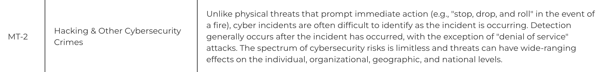
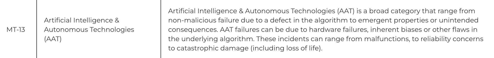
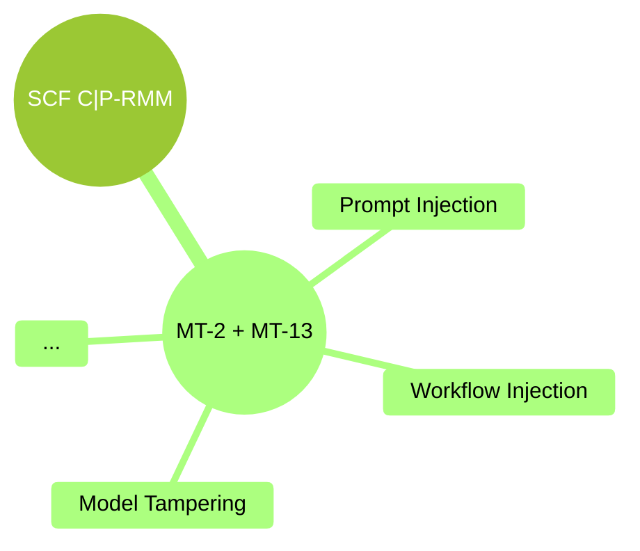

3

<h1 style="color:var(--aurora); font-size: 3em; font-weight: bold;">
Threats
</h1>

This chapter provides a comprehensive overview of the Threats specific to GenAI Security. Please, refer to the [SCF C\|P-RMM](../threat_vulnerability_risk/scf_cp_rmm.md) section within the [Threat and Vulnerability Frameworks](../threat_vulnerability_risk/index.md) chapter, as a starting point to understand what a Threat is versus a Risk or a Vulnerability.

The [SCF C\|P-RMM](https://securecontrolsframework.com/free/risk-management-model/) [[1]](#ref-SCF:CP-RMM:Web) [[2]](#ref-SCF:CP-RMM:PDF:v2025-2) Threat Catalogue presents two independent entries that fit GenAI Security: **MT-2** and **MT-13**, as seen in Figure 2.

 
<em>Figure 2: GenAI Security-related Threats found in <a href="https://securecontrolsframework.com/free/risk-management-model/">SCF C\|P-RMM</a>.</em>

These two entries cover the full breadth of GenAI Security Threats, but they do not provide the necessary depth to be able to discuss the specificities of such domain. Gurple extends the [SCF C\|P-RMM](https://securecontrolsframework.com/free/risk-management-model/) Threat Catalogue to detail it more granularly for GenAI Security, as seen in Figure 3.

<em>Figure 3: Extension of the SCF C\|P-RMM Threat Catalogue to detail specific GenAI Security Threats.</em>

For more information on the various possibilities of how these Threats can be delivered as attacks to GenAI systems, please refer to the [Attack Entry Points](../attack_entry_points/index.md) chapter.

 

---

# References

[1] “Cybersecurity & Data Privacy Risk Management Model (C).” <a href="https://securecontrolsframework.com/free/risk-management-model/">https://securecontrolsframework.com/free/risk-management-model/</a>.

 

[2] “Cybersecurity & Data Privacy Risk Management Model (CP-RMM) Overview.” <a href="https://securecontrolsframework.com/content/SCF-Risk-Management-Model.pdf">https://securecontrolsframework.com/content/SCF-Risk-Management-Model.pdf</a>, 2025.

 

